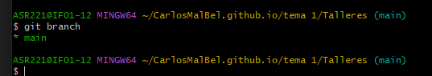
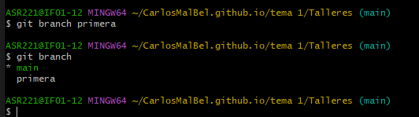
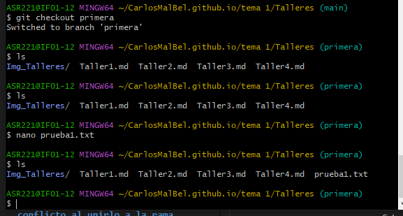
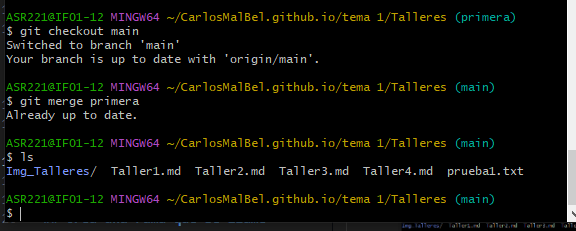
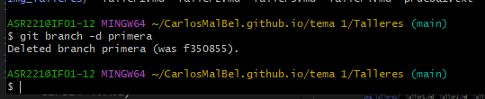

# Taller 3: Git. Trabajando con ramas y uniones

## Crea una rama que se llame primera en tu local, y ejecuta la instrucción necesaria para comprobar que se ha creado.

- Primero comprobamos que solo tenemos una rama creada, la main:    

- Ahora creamos la rama nueva:

## Crea un nuevo fichero en esta rama y fusiónalo con la principal. ¿Se ha producido conflicto? Razona la respuesta.

- Con el comando `git checkout primera` cambiamos a la rama nueva y creamos un fichero llamado "prueba1.txt"

- Y ahora la fusionamos.

- Y como solo tengo un solo objeto que se llame prueba1.txt no ocurre ningun conflicto.
## Borra la rama primera.

Con `git branch -d primera` borramos la rama.

## Crea una rama que se llame segunda, y modifica un fichero en ella para producir un conflicto al unirlo a la rama principal. Entrega el contenido del fichero donde se ha producido el conflicto.

- Pero no me da nigun conflicto

## en el punto anterior y sincroniza la rama segunda en el remoto. Entrega una captura de pantalla donde se vea que se ha creado la rama en el repositorio de GitHub.

- Tampoco me da error de conflicto.