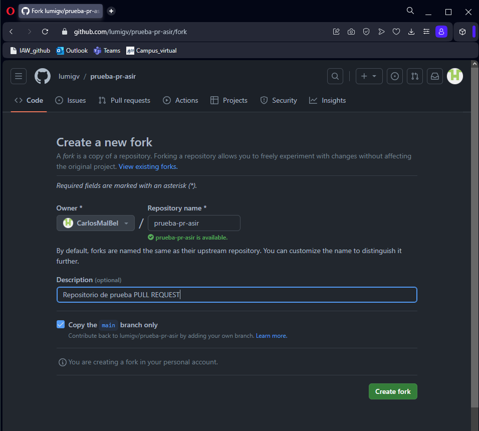
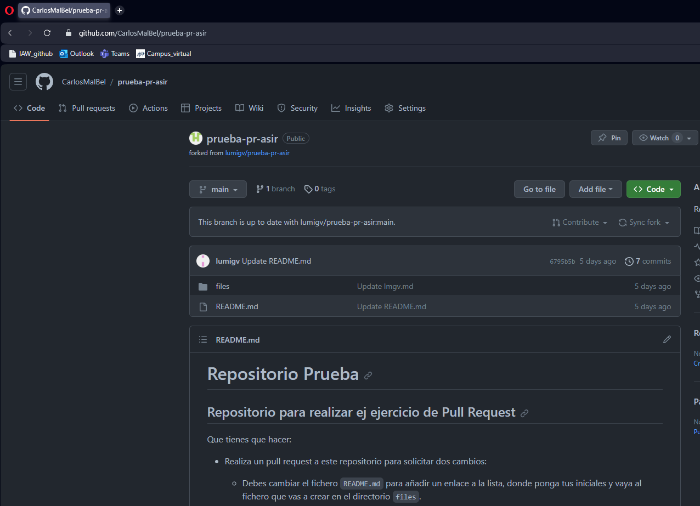

# Taller 4: ¿Cómo colaborar en un proyecto de software libre? ¿Qué es un Pull Request (PR)?”

## Ejer1

* Para realizar el `Pull Request` primero debemos ir al archivo en **GitHub**, despues le damos a Fork y se los despliega la siguiente pestaña.

* Ahora le damos *Create fork* y se nos clona en el repositorio de **GitHub**, ahora forma parte de nuestros archivos, pero para poder editarlo debemos de hacer un `git clone` para poder tenerlo en local y editar el archivo de **README.md**

